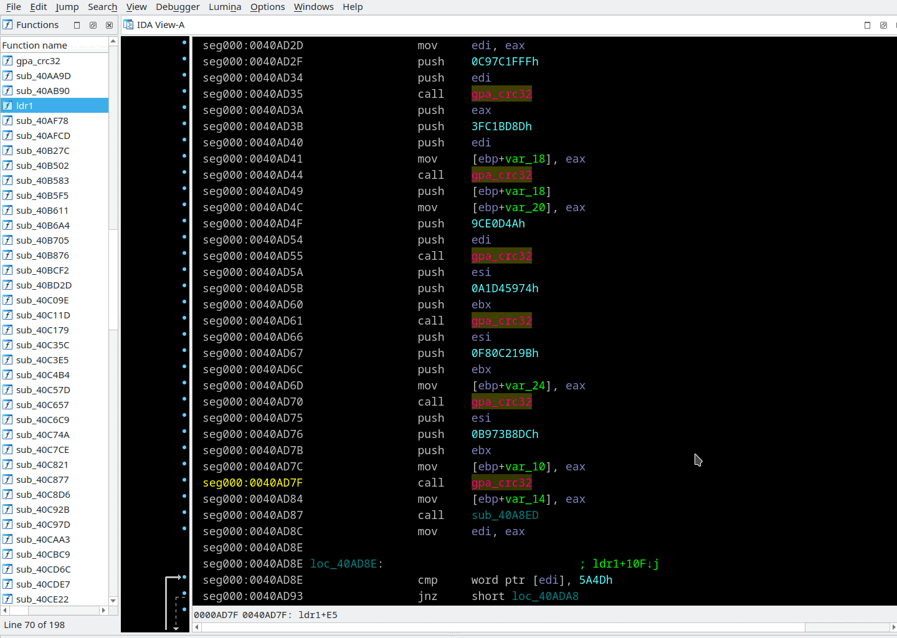
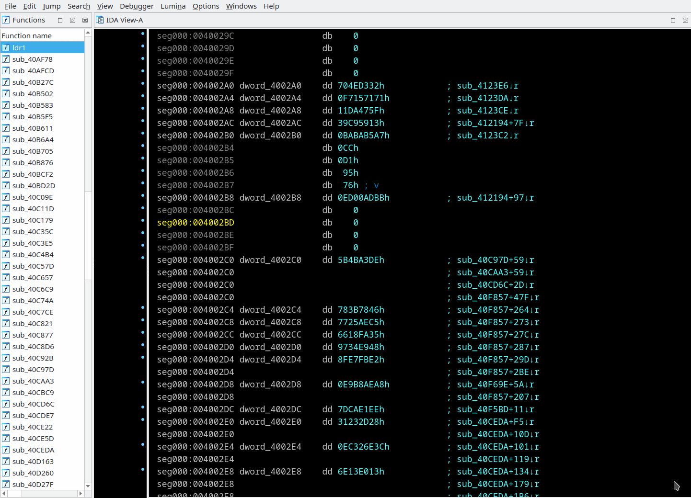

## Automatic scan for API names hashes
Menu *"Edit/Other/Turn on APIhashes scan..."*

Often, when RE shellcode we can see that Windows API pointers are taken not by name (ex: GetProcAddress) but calculating and comparing some hash of API name.

Click menu *"Edit/Other/Turn on APIhashes scan..."*. Hover mouse cursor over hash name in appeared dialog window for the hash details tooltip. Select appropriate hash type.  
`Basis` and `Prime` fields of the dialog are filled with default values on hash algorithm change. Where `Basis` is the initial hash value. `Prime` number is a cyclic hash modifier.

The plugin reads file `IDADIR/plugins/apilist.txt` and calculates hashes of names from the list. Then, if the constant value shown in pseudocode view is equal of one of hashes the name is source of that hash, it will automatically be shown in comment. In the disasm view these constants are compared at the moment of code/data creation. So, if you want to see hash meaning in disasm - undefine and then recreate code/data.

> ⚠️ Avoid negative 32bits values in pseudocode view, it seems IDA storing it in 64bits sign-extended form. As workaround just convert these negative constants to unsigned hex representation.





You are may modify `apilist.txt` to add new API names. `apilist.txt` have a pretty simple format:
```
<empty line>
<DllName1>
<ApiName1>
<ApiName2>
...
<ApiNameN>
<empty line>
<DllName2>
<empty line>
<DllName3>
...
```
Example of `IDADIR/plugins/apilist.txt`:
```

ADVAPI32.dll
RegCreateKeyA
RegCreateKeyExA
RegCreateKeyExW
RegCreateKeyW
RegDeleteKeyA

KERNEL32.dll
CreateFileA
CreateFileMappingA
CreateFileW

wininit.exe
```
