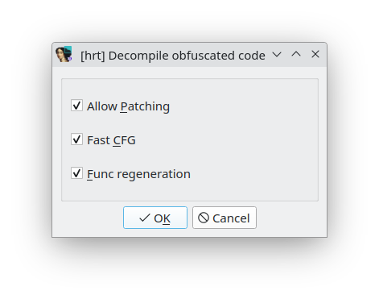

## Decompile obfuscated code
Menu *"View/Open subviews/Decompile obfuscated code (Alt-F5)"*

This experimental feature have the intention to force decompilation a code that Hex-Rays unwilling to decompile.
Such code may be full of trashy void operations, liberal stack movement, smeared excessive jumps, calls and returns used as jumps.
Purpose of this feature to force decompiler to clean up trash and show a crumb of meaning of the code does.

How does it work:
 - At first the plugin tries to collect ranges of code spread over binary that belongs one function. 
   If any other subroutines is met in the path - it will be destroyed. If data or unexplored bytes are met in the path - it will be converted to code automatically or ask user to deal with it.
 - New disassembler's proc is created from the collected code chunks.
 - Then for the Hex-Rays decompiler are installed few microcode hooks (handlers) and generated microcode. 
   There are also few sets of microcode level custom optimizers. Part of them works always, part only in time of "Decompile obfuscated code" mode.
 - If hookers detect return statement is turned into jump, processing is above steps repeated for newly discovered code at jump target.
 - On final pass collected chunks are decompiled with decompile_snippet
 - Then, just to open new pseudocode window, the plugin creates new segment "`[hrt]nullsub`" with `nullsub_1` function inside and open pseudocode window to show it
   (for a very short time) and then pseudocode view immediately switched to showing results of obfuscated code decompilation.
 
How to use it: just press "Alt-F5" or select menu entry *"View/Open subviews/Decompile obfuscated code"* at entry point of obfuscated code in disasm view.



Dialog window with few options is appeared. All checked on by default, might be unchecked in various situations. Just try different combinations of these to take better results:
 - Allow Patching: implemented now only for "metapc" processor. Patch the code of double conditional jumps with inverted condition like:
```
jle short loc_403F2E
<between jumps, may be something meaningless like NOPs, removed away by microcode optimizer>
jg  short loc_403F2E
```
to short unconditional jump
```
jmp short loc_403F2E ; ;patched: jle loc_403F2E
```
Original code mnemonic are left on instruction comment. If "Allow Patching" is unchecked the plugin deals with such jumps in a processor independent way at Hex-Rays microcode level (unstable in some situations).
 - Fast CFG: if checked, the additional pre-processing step with help of disassembler and flow chart regeneration after each block adding, that is faster then decompiling.
   When "Fast CFG" is unchecked collect chunks of the procedure with help of decompiler only.
   It may be more suitable in situation then decompiler may convert conditional jumps to unconditional like in example below:
```
  mov     eax, 1
  dec     eax
  jz      short loc_xxx
; some trashy code that breaks decompiler
```
 - Func regeneration: if checked - additional step that destroy, re-create and re-analyze the function from scratch after chunks were collected and before microcode of the function generation.

>📝 **Notes:** 
> - Deleting whole function or function's tails that have been met during CFG creation doesn't work stable enough.
>   For better results it may be a good idea to manually delete functions on execution path or even mark all of the code as unexplored before trying to decompile it.
> - After some manual changes in pseudocode Hex-Rays loses returns-converted-to-jump and truncate results of decompilation. You may press "Alt-F5" in pseudocode view to restore lost parts.


