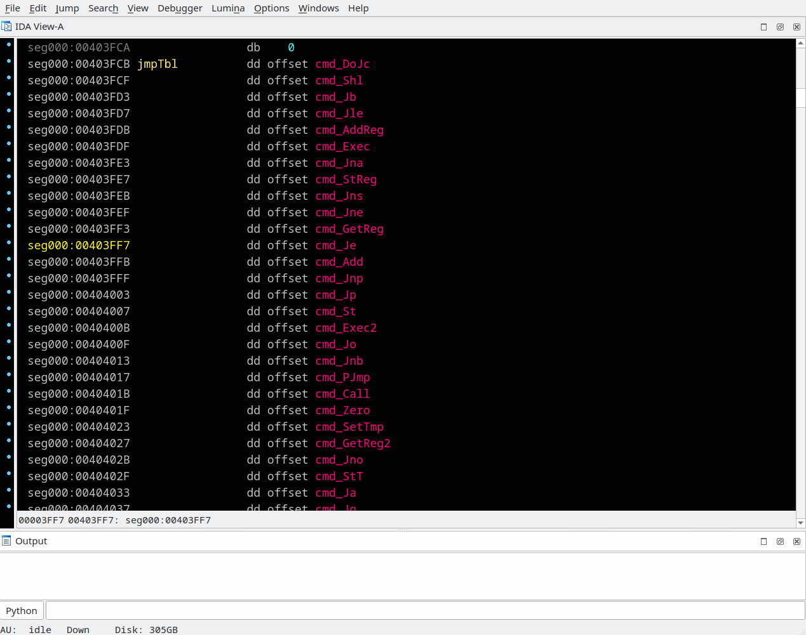
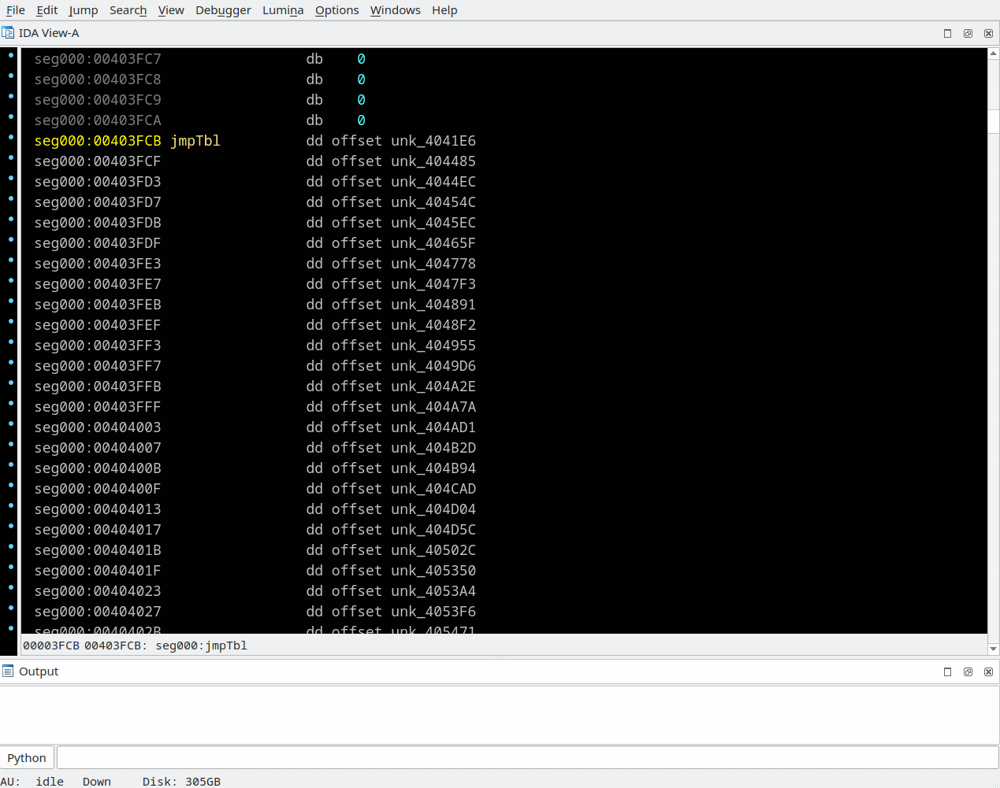

## Microcode signatures
Context menu *"Create MSIG for the function"*  
Menu *"File/Produce file/Create MSIG file..."*, *"File/Load file/MSIG file..."*

Ida's flirt signatures depends a lot on a processor architecture and fails on an obfuscated code. Microcode signatures have no such limitation. It is applied on microcode during latest decompilation stage when obfuscations possible gone.

You can create msig one by one with selecting *"Create MSIG for the function"* in pseudocode context menu and then save them all by menu *"File/Produce file/Create MSIG file..."*. 
Or create and save msigs for all user-named function at once. 
There is an option in the "Create MSIG file" dialog:
 * Minimal signature lenghth - is a minimal length in bytes of the procedure body, and the same time a minimal length on microcode is used to build signature. This value is also used for a manual signature creation.


>📝 **Notes:** 
> - MSIG file is an editable text file where each line is MD5 hash of the microcode and the signature name.
> - There are possible multiple names for a one signature because of the same microcode was generated for different procedures.
> - It's recommended to look into just created MSIG file and consider deleting some of longest lines because they can be a reason of an annoying false positives
> - For a procedure has at least one call statement inside in addition to regular Strict signature, one more, so called Relaxed signature is created. Relaxed signature is marked by letter 'r' before the name.
> - In Relaxed mode call's arguments, operand size and resizing instructions are ignored. Matching a Relaxed signature is not the 100% reason to rename recognized proc, but just a hint showing similarity.

Load signatures with *"File/Load file/MSIG file..."* Multiple `.msig` files may be loaded. Last loaded MSIG filename of is stored in database and will be used to auto-load MSIG on next IDB opening.

**The following workflow is recommended for effective using MSIGs:**
1) On well reversed IDB:
  - [Import user named functions prototypes into the local type library](doc/import_unf_types.md)
  - Export type info as *"Create C header file"* or *"Dump typeinfo to IDC file"*
  - *"Create MSIG file"*
2) On new IDB:
  - Ensure standard type libraries are loaded (Shift-F11)
  - Load type info generated on well reversed IDB on step #1 by *"Parse C header file"* or execute *"Script file"*. Be aware it probably required to edit `.h` file to resolve errors on types importing.
  - *Load MSIG file*

The comment is appeared it the first pseudocode line when a matching signature has been found. And the procedure will be renamed (and recasted if the typelibrary has function declaration with the same name) in case of Strict signature matching, but a new name appears just after repeating `F5` key press.
```
// The function matches msig: 'msig-name'. Press F5 to refresh pseudocode.
```





